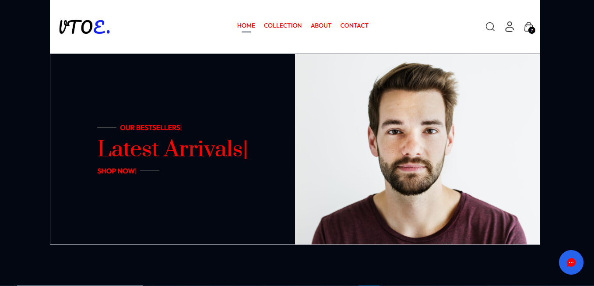

# 👕 VTOE – Virtual Try-On E-Commerce Platform



VTOE is a web-based virtual try-on e-commerce platform that allows users to preview clothing on a 3D human model before purchasing.  
The system enhances online shopping by combining real-time 3D visualization with a modern e-commerce experience.

---

## 🚀 Features

- 🧍‍♂️ 3D Virtual Try-On (Male & Female models)
- 🎨 Change clothing color and size dynamically
- 📏 Size-based fitting using user inputs
- 🛒 Full e-commerce functionality (cart, products)
- ⚡ Fast and responsive UI
- 🌐 Cloud-hosted 3D models (Supabase Storage)
- 🎥 Animations using Framer Motion
- 🔐 Secure backend APIs

---

## 🛠 Tech Stack

### Frontend
- React.js
- Vite
- Tailwind CSS
- Three.js / React Three Fiber
- Framer Motion

### Backend
- Node.js
- Express.js
- MongoDB
- JWT Authentication

### Cloud & Assets
- Supabase Storage (3D Models)
- MongoDB Atlas
- Cloudinary (Images)

---

## Installation and Setup

1. **Clone Repository** :
   ```bash
   git clone https://github.com/AnasSaeed09/VTOE.git
   cd VTOE
2. **Install Dependencies** :
   - Frontend :
    ```bash
     cd frontend
     npm install
     npm run dev
   ```
   - Backend :
    ```bash
    cd backend
    npm install
    node server.js

[Live Demo](https://vtoe-ffrontend.vercel.app/) : `https://vtoe-ffrontend.vercel.app/`

---

## 🧪 Usage
1. Open the website
2. Select the product
3. Choose size
4. Click Try-on
5. Views clothing on 3D model
6. Add to cart and continue shoping

## 📌 Future Improvements
- AI based recommendations
- Body measurement via camera
- More realistic cloth physics
- Mobile optimization
- Female accessories support

## 👨‍💻 Contributors
- [AnasSaeed09](https://github.com/AnasSaeed09)

---

## 📅 Project Info
- Project Type: Final Year Project (FYP)
- Developed on July 28, 2025

---
## 📄 License

**This Project is for educational purposes**.

---

  
    
